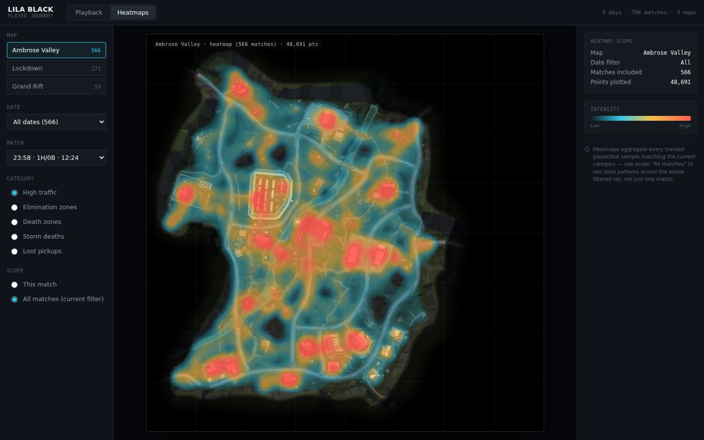

# LILA BLACK — Player Journey Visualization Tool

A browser-based tool for exploring player/bot telemetry from **LILA BLACK**, letting a
Level Designer scrub through individual matches and see aggregate heatmaps
(traffic, eliminations, deaths, storm deaths, loot) across any map/date/match
filter.

**Live demo:** https://claude.ai/artifact/LNfCR5pDmxZhtCSgvFv7MP (a self-contained
single-file build of this exact app, for quick viewing). For the actual
assignment submission, deploy this repo to Vercel/Netlify/GitHub Pages (see
"Deploying" below) and put that URL here instead.



## Tech stack

- **Vanilla HTML/CSS/JS**, Canvas 2D rendering. No framework, no build step —
  open `index.html` (via a static server) and it runs.
- **Data pipeline**: pure-Python, zero third-party dependencies (see
  [`ARCHITECTURE.md`](ARCHITECTURE.md) for why — short version: `pyarrow` was
  not available in the build environment, so the pipeline includes a small
  from-scratch Parquet reader instead of depending on it).
- **Hosting**: fully static — `index.html` + `styles.css` + `app.js` +
  `data/dataset.json` + three background images. Deploys to Vercel, Netlify,
  GitHub Pages, or any static host with zero configuration.

## Project structure

```
.
├── index.html              # app shell
├── styles.css               # tactical/ops-room UI theme
├── app.js                   # all client logic: filtering, canvas rendering,
│                             # playback, heatmaps
├── data/
│   └── dataset.json         # precomputed, compact dataset (~2 MB) covering
│                             # all 796 matches / 89k events
├── assets/
│   ├── AmbroseValley.jpg     # minimaps, resized to 1024x1024
│   ├── GrandRift.jpg
│   └── Lockdown.jpg
├── scripts/                  # the offline data pipeline (parquet -> dataset.json)
│   ├── thrift_compact.py     # generic Thrift compact-protocol decoder
│   ├── mini_parquet.py       # dependency-free Parquet reader (uses the above)
│   ├── build_dataset.py      # walks player_data/, parses every .nakama-0 file
│   └── compact_export.py     # raw parsed data -> data/dataset.json
├── ARCHITECTURE.md
├── INSIGHTS.md
└── README.md
```

## Setup / running locally

No build step and no npm dependencies for the app itself. You only need a
static file server (browsers block `fetch()` of local files opened via
`file://`):

```bash
# from the repo root
python3 -m http.server 8000
# then open http://localhost:8000
```

or with Node:

```bash
npx serve .
```

### Regenerating `data/dataset.json` from the raw parquet files

Not needed to run the app (the dataset is already checked in), but if the raw
`player_data/` folder is available and you want to rebuild it:

```bash
cd scripts
python3 build_dataset.py      # parses every .nakama-0 file -> raw_matches.json
python3 compact_export.py     # raw_matches.json -> ../data/dataset.json
```

Both scripts use only the Python standard library — no `pip install` required.

## Env vars

None. Everything is static; there is no backend/API.

## Deploying

Any static host works. For example, with Vercel:

```bash
npm i -g vercel   # or use the Vercel dashboard's "Import Project"
vercel --prod
```

Or drag-and-drop the repo folder into Netlify's deploy UI, or push to a
`gh-pages` branch / enable GitHub Pages on this repo.

## Using the tool

- **Playback mode**: pick a Map → Date → Match, then press play. Player
  paths draw in, bots as triangles / humans as circles, with distinct icons
  for eliminations, deaths, storm deaths, and loot pickups as they occur.
  The full route is always visible faintly so you have context for where
  the match is headed.
- **Heatmap mode**: pick a category (traffic / eliminations / deaths / storm
  deaths / loot) and a scope (just the selected match, or every match
  matching the current Map + Date filter) to see zone-level patterns.

See [`ARCHITECTURE.md`](ARCHITECTURE.md) for how the data flows end-to-end,
the coordinate-mapping approach, and the assumptions made along the way, and
[`INSIGHTS.md`](INSIGHTS.md) for what the data actually showed once the tool
was built.
